shinyCytokine is a New Tool for the Visualization of High-Dimensional Cell Polyfunctionality
============================================================================================

------------

Background
----------

- Obligatory short history of single cell assays, flow cytometry.

- Challenges in the visualization of data from flow cytometry experiments.

  - Polyfunctionality --> we care about the 2^n potential combinations 
  of cytokines. Both marginal and joint distributions.

- We care about:
  
  - The distribution of these cytokine profiles, and
  
  - How these distributions relate/differ among meta-data variables
  (stimulation applied, study intervention, age, gender, etc.)
  
- Need to explore and visualize this large space efficently and informatively.

- SPICE is a commonly used platform. It is a flow cytometry 
analysis workstation.

- We are providing an alternative for visualization.

- Thesis: boxplots are better for comparison than pie charts. Why?
Comparing raw means is misleading; comparing distributions better.

- shinyCytokine is better as a visualization app; SPICE is better
as a flow analysis workstation.

- shinyCytokine supplements existing analysis tools; SPICE tries
to replace them.
  
Data Description
-----------------

- Where our data comes from.

- We deal with post-gated data.

- We are visualizing large binary matrices, which can be collapsed
into proportions.

- Import data format?

shinyCytokine Implementation
----------------------------

- Built upon RStudio's shiny interface.

- Built entirely with R, with some JavaScript enhancements
(double-click to enlarge plot)

- Because the source code is available for both shiny and
shinyCytokine, the application can easily be inspected, tested,
and extended by other researchers. Extendable by anyone with
HTML + JavaScript or R programming experience.

- This is really worth emphasizing: if a lab likes shinyCytokine,
but wishes things were a bit different, they are free to modify
the app to visualize their data as desired. All of the plotting
infrastructure in R is available, as well as JavaScript plotting
libraries (d3, HighCharts, everything else 
[here](http://chimera.labs.oreilly.com/books/1230000000345/ch02.html#alternatives_2)

- All you need is a browser. *note: IE (<10) is not a browser. It is
an abomination.

- Easily deployed and shared both inter- and intra-lab.

#### The following material needs to be rearranged as needed...

----------------------------

Description of shinyCytokine
----------------------------

shinyCytokine gives us multiple views of our cytokine proportions.

A panel of options allows us to quickly and efficiently filter and
facet based on different quantities of interest.

Can visualize both joint and marginal distributions.

Can exclude lower-order combinations of cytokines, focus on
higher order combinations.

shinyCytokine gives four kinds of plots:

- Heatmap (rows are samples, columns are combinations of cytokines,
fill is proportion of cells expressing particular combination of cytokines)
  - Can be facetted by one metadata variable
  - Questions answered: "What is the global view of the distribution
  of cytokine profiles? What if I facet by a single variable?"

- Cytokine profile (for a given individual, view the distribution
of the proportion of cells producing cytokines, across samples)
  - Can be doubly facetted.
  - Questions answered: "What is the variability in proportions like
  between samples for this individual? Does the distribution
  differ by metadata variables?"
  
- Degree of Functionality
  - Degree of functionality is thought to be linked to immune response.
  That is, cells that express more cytokines --> cells more involved
  in immune response.
  - For a given individual, we visualize this degree of functionality,
  across samples.
  - Can be facetted.
  - Questions answered: "Is the DOF higher for samples treated with
  xyz stimulation? Does this stimulation only work with male subjects?"
  
- Boxplots
  - A better summary of the distribution of proportions.
  - Compare distributions by facetted with up to two variables.

Main plus (relative to SPICE): we compare distributions, rather than raw means, and
hence are less likely to make erroneous conclusions from our
visualization.

<a href='SPICE_Comparison-img/heatmap.png'>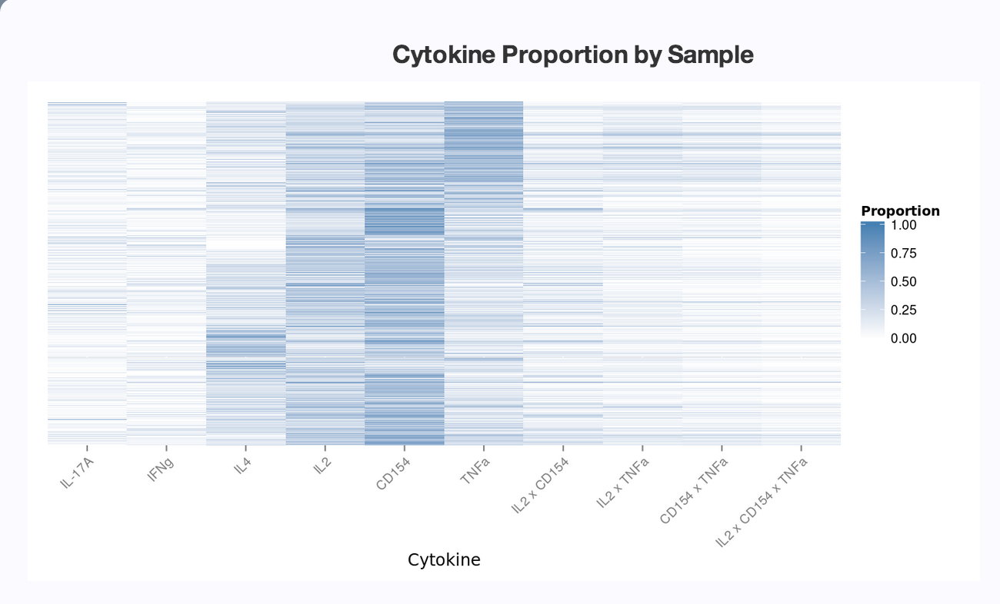</a>

Heatmap
========================================================

Facetting reveals more 'obvious' patterns.
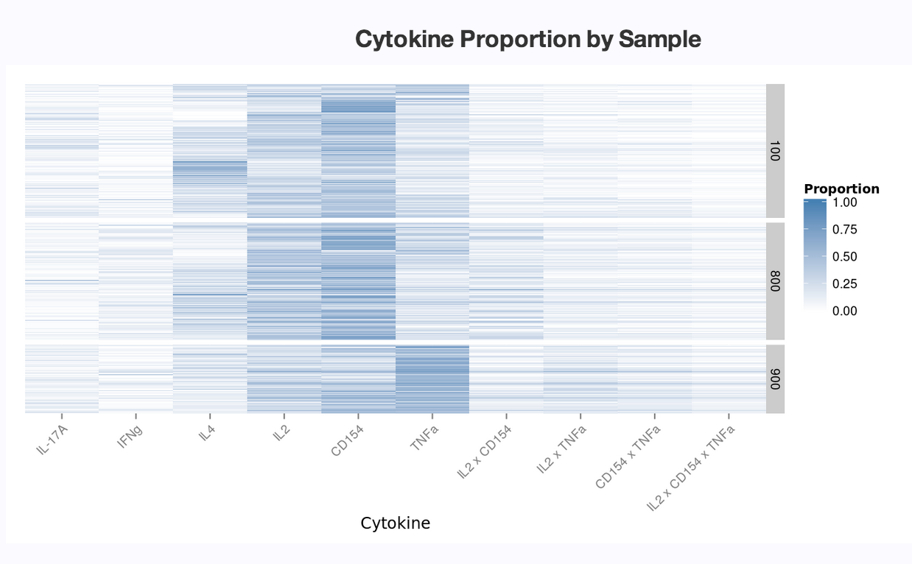

Cytokine Profile
=======================================================
Allows us to view the variation in cytokine proportion,
by sample, for a particular individual.

These plots can be facetted as well.

Cytokine Profile
========================================================
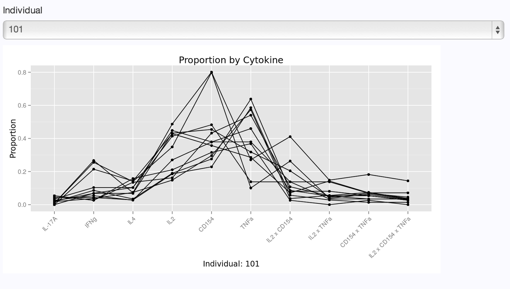

Degree of Functionality
=======================================================
TODO

Boxplots
=======================================================
Allows us to more readily compare distributions of
proportions by different meta-data variables.

Gives an alternative way of visualizing the distribution
of proportions; similar to the heatmap.

Can facet by 2 variables, colour by 1 other variable.

Boxplots
========================================================
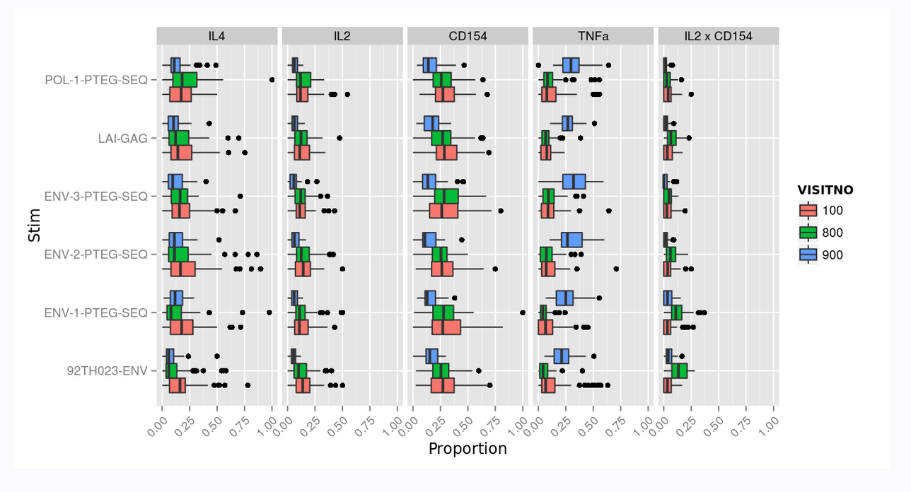

Description of SPICE
========================================================

[SPICE](http://exon.niaid.nih.gov/SPICE/) is software
for visualizing and performing simple analyses of 
cytokine proportions.

Only runs on Mac OS X. No source code released.

Import data as a single tab/comma delimited file. 

* Each row is
a unique combination of variables; typically a unique 
cytokine profile, + other cell/sample-specific info.

SPICE
========================================================

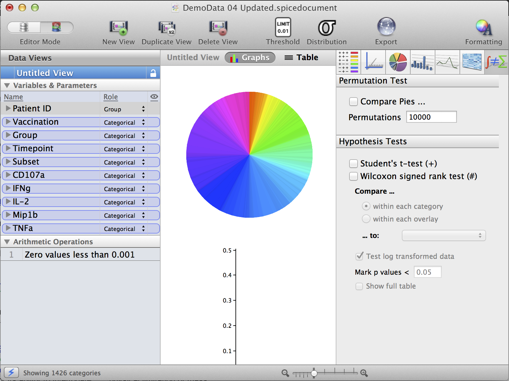

Main Features
========================================================

* Interactively and easily select different 'roles' for
variables
  * Categorical (use variable in determining unique 'groups' of observations)
  * Overlay (facet pie charts by this variable)
  * Sum, average (collapse proportions over this variable, using sum or average)
  * Group (essentially, 'ignore' or 'collapse' over this variable)
  
Variable Roles
========================================================

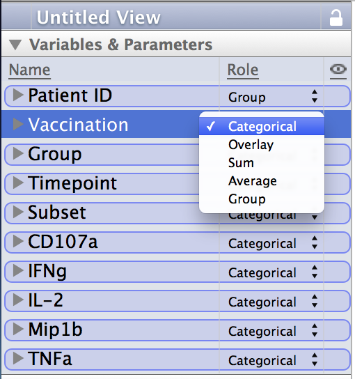

***

Similar to the facetting controls in shinyCytokine, but
with more options for collapsing variables.
  
Main Features
========================================================

### Pie charts

Each slice is a [mean/median] of proportions.

Allows one to visualize how 'the [mean/median] for each 
unique combination of categorical variables' differs.

Arcs show marginals.

***

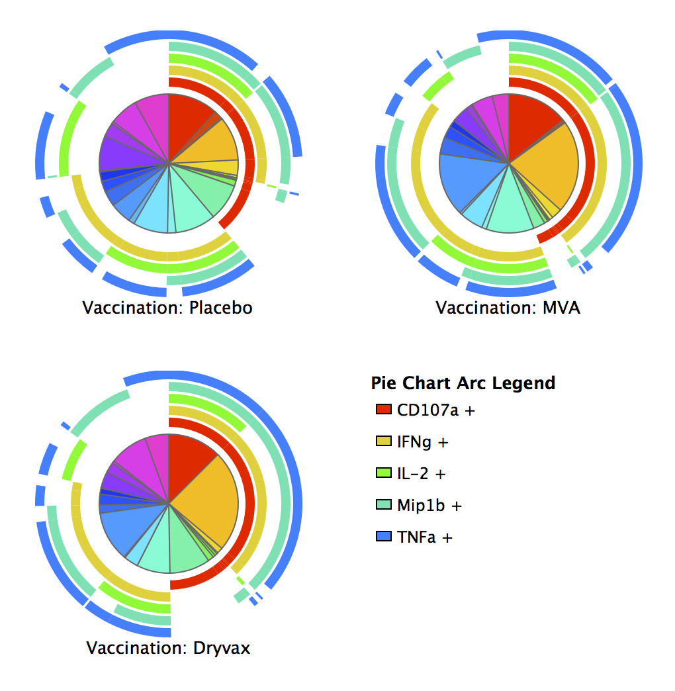

Criticisms
======================================================

- Cannot get a legend for each pie 'slice'
  - although this information is contained in the other
  bar chart
- No notion of statistical variance in chart
- Potentially misleading visual comparisons of means
  
Main Features
=======================================================

- Bar Chart: Plot bars that extend to the (mean, median, range, IQR)
  of the data for each unique combination
  
- Can augment with points, whiskers, error bars -- however, scale
is not easily modifiable.
  
***

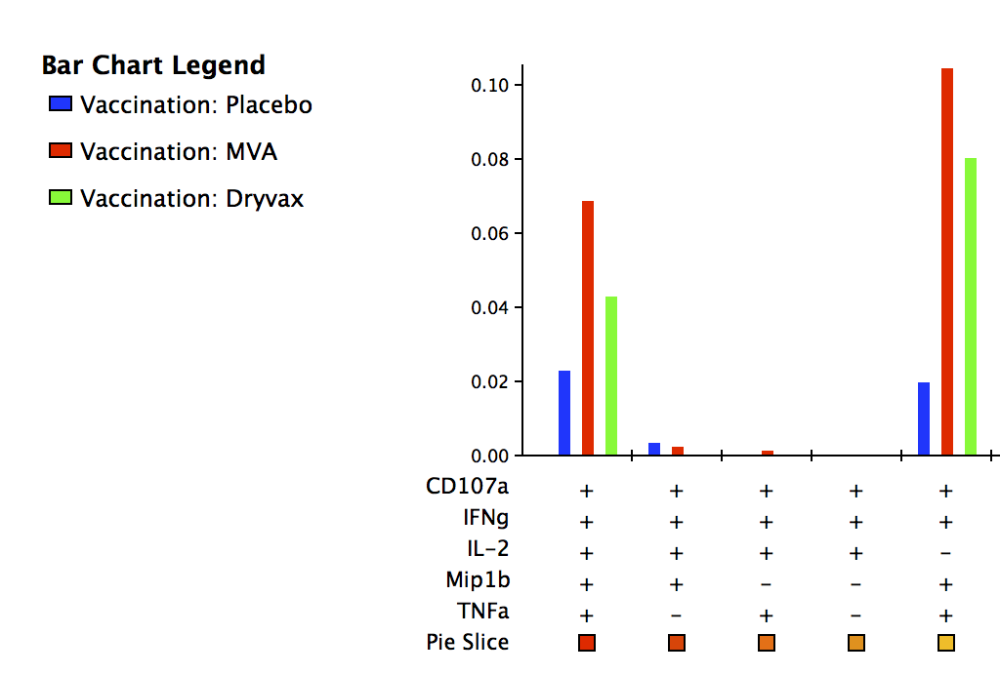

Main Features
========================================================

- Can modify barchart settings to get something
like a box and whisker plot.

- Current settings: bar at the middle is the mean,
whiskers are SD. Median gets squashed to the bottom.

- It's ugly.

***

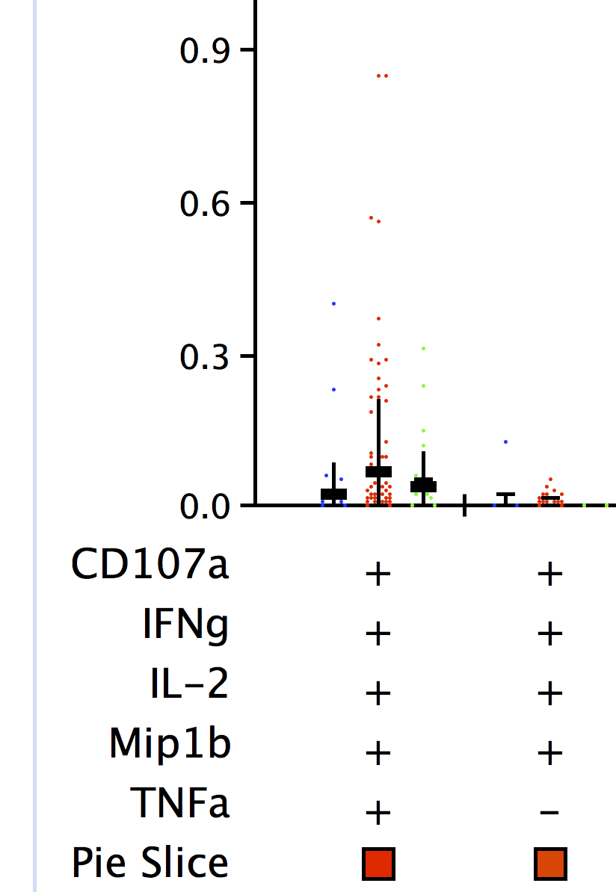

Main Features
=======================================================

### NPlot

Similar to barchart, but plotted as linechart.

- Automatically splits over 'overlay' variables.

- Each line is generated by the 'group'ed variables.

- I average over PTID, Timepoint, Group to get a
sensible image.

***

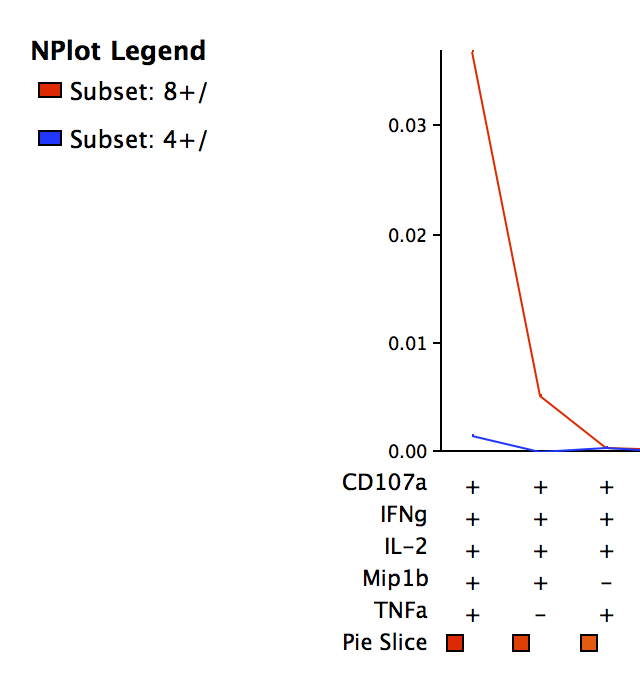

Main Features
=======================================================

### 'CoolPlot' **

Heatmap of 'overlay' variables vs 'categorical' variables.

Similar to the shinyCytokine heatmap, as though we 'overlay' all
'non-cytokine' variables. I think?

Selecting all non-cytokine variables as overlay kills SPICE.

** Note: the name is 'CoolPlot', not CoolPlot

***

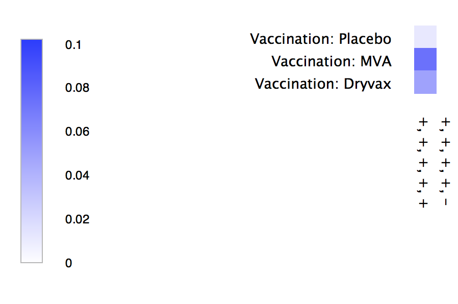

Pros and Cons
========================================================

### shinyCytokine
\+ Open source

\+ Runs in the browser

\+/- Controls + Plots part of one view

\- Can't save 'state' / open multiple 'views'

\+/- Facetting options limited (less flexible, less complex)

***

### SPICE
\- Closed source

\- Only runs on Mac OS

\+/- Controls and plots somewhat separated

\+ Multiple views / save state

\+/- Can specify different 'roles' for each variable (more flexible, more complex)

Pros and Cons
========================================================

### shinyCytokine
\+ Easily zoom in on figure with double-click

\+ View updates automatically upon parameter change

\- (Currently) no option for plot export

\+ Default plot settings are usually informative

***

### SPICE
\+ Control a global workspace zoom level

\+ Can set automatic updates at time intervals

\+ Can export graphs

\+/- Statistical testing built in

\- Plot defaults are either uninformative or misleading

Pros and Cons
========================================================

### shinyCytokine

\+/- Cannot edit data from within app

\- Cannot save and load state (yet?)

***

### SPICE

\+/- Can add, remove, edit variables from within SPICE

\+ Can save and load workspaces

Similarities
========================================================

shinyCytokine's heatmap and SPICE's 'CoolPlot' are similar

* shinyCytokine is restricted to x-variable being cytokine
  combinations, and y-variable being samples
  
* 'CoolPlot' plots proportions as `overlay ~ categorical`

* shinyCytokine's heatmap can be facetted by a variable; 
  coolPlot cannot
  
* 'CoolPlot' can be resized, but the labels don't resize
  intelligently (become too big / too small)
  
Similarities
========================================================

shinyCytokine's 'cytokine profile' and SPICE's barchart
/ nPlot are similar

* shinyCytokine plots proportion by cytokine for a particular
  individual as points, connected by lines.
  
* SPICE produces barplots up to mean / median by default.
  Misleading. But can plot points instead.
  
* SPICE has more control over what defines a unique 'group'.

Conclusion
========================================================

shinyCytokine is a better tool for visualization of
cytokine data.

SPICE is a better workspace for the visualization,
analysis and modification of cytokine data.

shinyCytokine intends to integrate with other programmatic
workflows. SPICE acts as a stand-alone analysis application.

shinyCytokine can be easily deployed with a particular set of
data for view / usage by other researchers; all they need is a 
web browser.

Conclusion
=======================================================

Ultimately, SPICE is limited relative to using a standard
programming environment.
